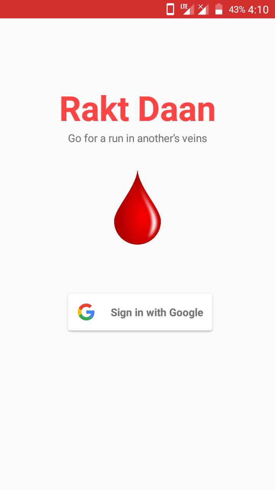
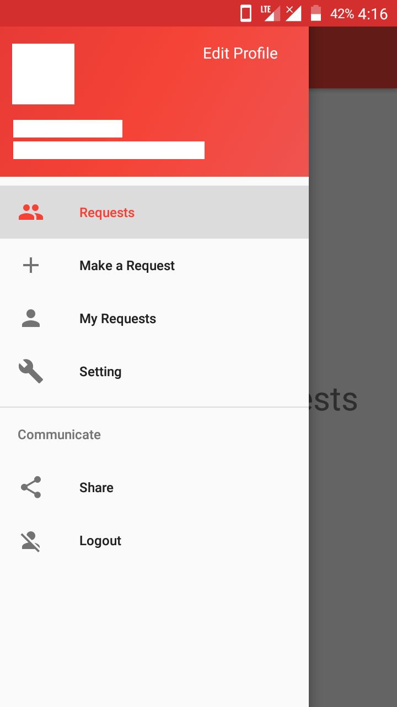
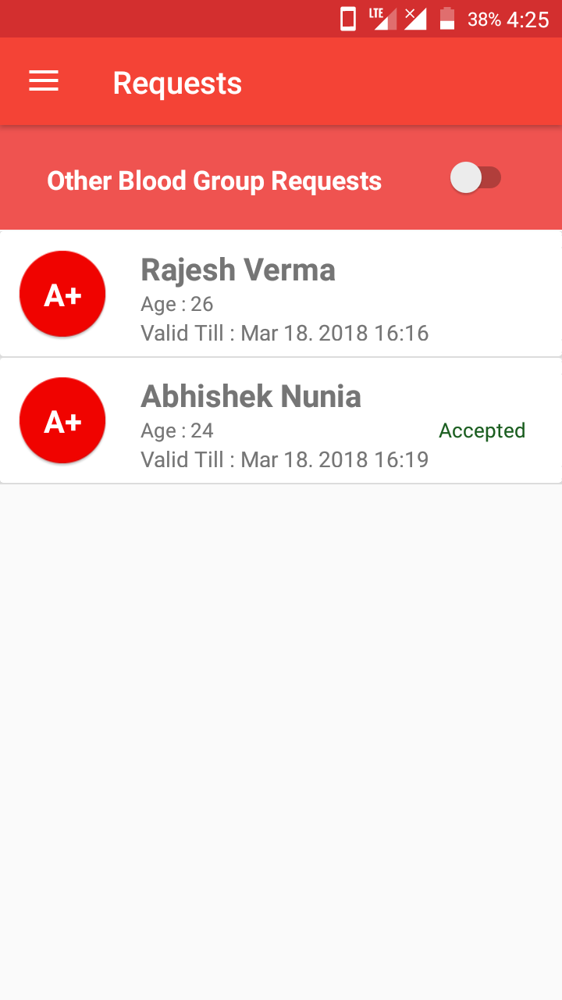
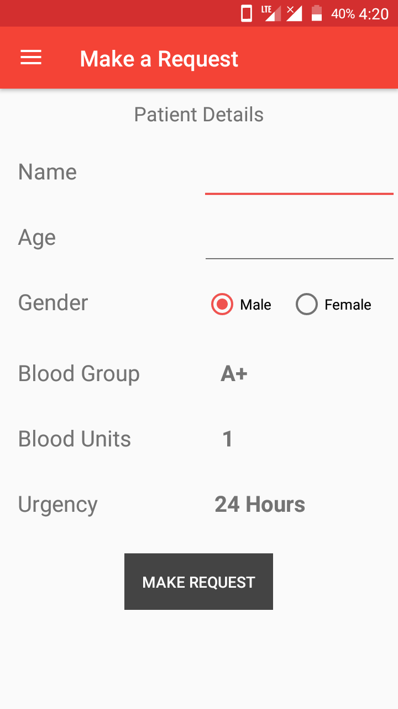
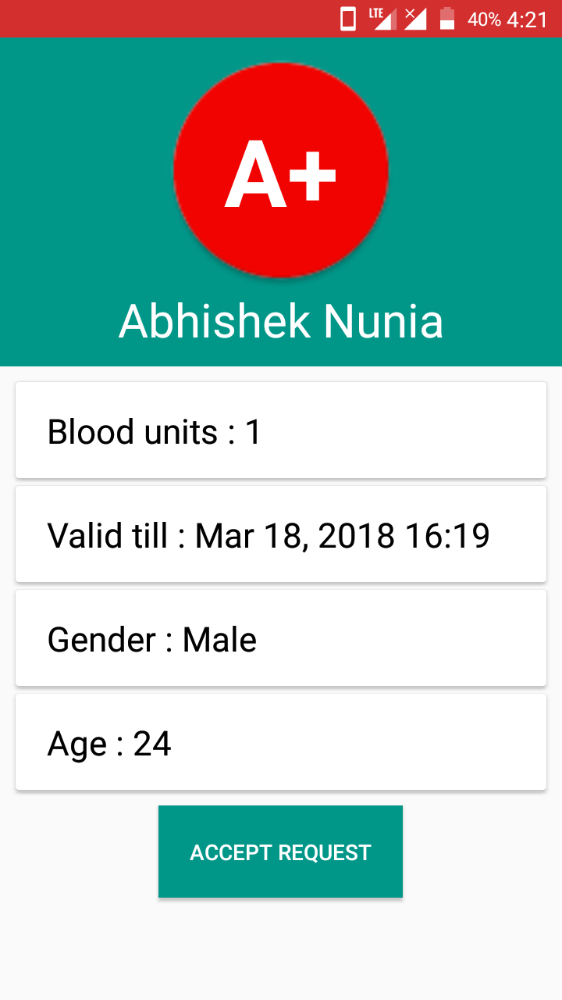
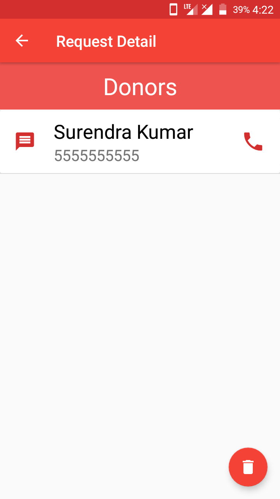

# RaktDaan
### A blood donation app

 

A blood-donation Android app, requests can be made,
accepted, deleted and edited. Current requests can be viewed on the basis of
one's blood group.

[Download APK](https://drive.google.com/uc?export=download&id=1Iif_LRV2bXN5516eJUhf-Af4j4sfbFYP)

### Screenshots
Login Page            |  Navigation Panel | Requests
:-------------------------:|:-------------------------:|:-------------------------:
  |  | 

Make a request             |  View and Accept a request  | Donors 
:-------------------------:|:-------------------------:|:-------------------------:
  |  | 

 
